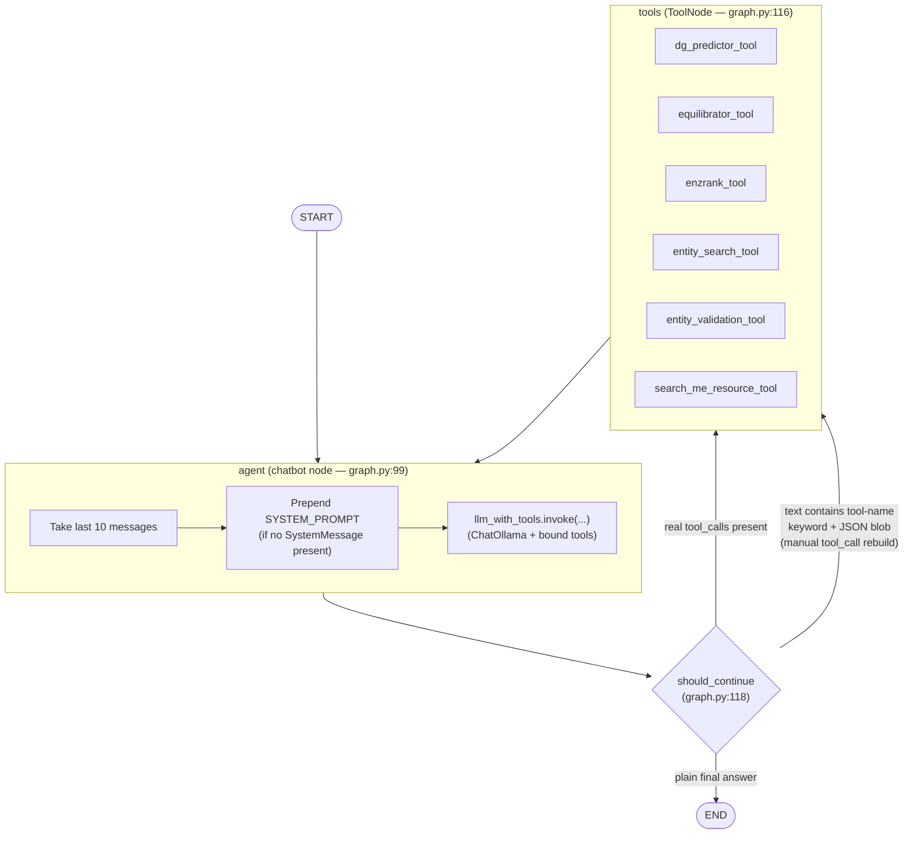

# LangGraph Structure — `graph.py`

Sketch of the graph built in `workflow = StateGraph(AgentState)` (graph.py:161-169).

## Node / edge summary

| Element | Type | Defined at | Purpose |
|---|---|---|---|
| `AgentState` | state schema | graph.py:50 | Single field `messages: list[BaseMessage]`, merged via `add_messages` |
| `agent` node | function `chatbot` | graph.py:99 | Truncates history to last 10 msgs, injects `SYSTEM_PROMPT` if missing, calls `llm_with_tools.invoke()` |
| `tools` node | `ToolNode(tools)` | graph.py:116 | Executes whichever tool was called; results appended as `ToolMessage`s |
| `should_continue` | conditional edge fn | graph.py:118 | Routes `agent → tools` if the LLM emitted real `tool_calls`, **or** if it emitted a tool call as raw JSON text (fallback parser for models that don't call tools properly); otherwise routes to `END` |
| `START → agent` | fixed edge | graph.py:165 | Entry point |
| `agent → {tools, END}` | conditional edge | graph.py:166 | Branch point (see above) |
| `tools → agent` | fixed edge | graph.py:167 | Loop back after any tool call — classic ReAct loop |
| `memory` | `SqliteSaver` checkpointer | graph.py:29 | Persists per-`thread_id` conversation state to `data/agent_memory/agent_memory.sqlite` |

## Tools bound to the LLM (graph.py:32-39)

- **`dg_predictor_tool`** — ΔG for novel/artificial reactions (simple IDs, no `kegg:` prefix)
- **`equilibrator_tool`** — ΔG for standard biochemical reactions (requires `kegg:` prefix)
- **`enzrank_tool`** — enzyme ranking (simple IDs)
- **`entity_search_tool`** — name → KEGG ID lookup
- **`entity_validation_tool`** — decode/validate a KEGG ID
- **`search_me_resource_tool`** — metabolic pathway design search

## Notable design quirk

`should_continue` has a manual fallback (graph.py:126-154): if the LLM's plain-text response contains a tool-name keyword and an embedded `{...}` JSON blob (instead of a proper structured tool call), the code parses it, guesses the tool name from the JSON shape if not explicit, and manually injects a `tool_calls` entry onto the message before routing to `tools`. This compensates for `ChatOllama` models that sometimes fail to use native tool-calling and instead print the call as text.
